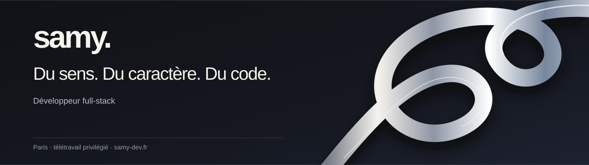
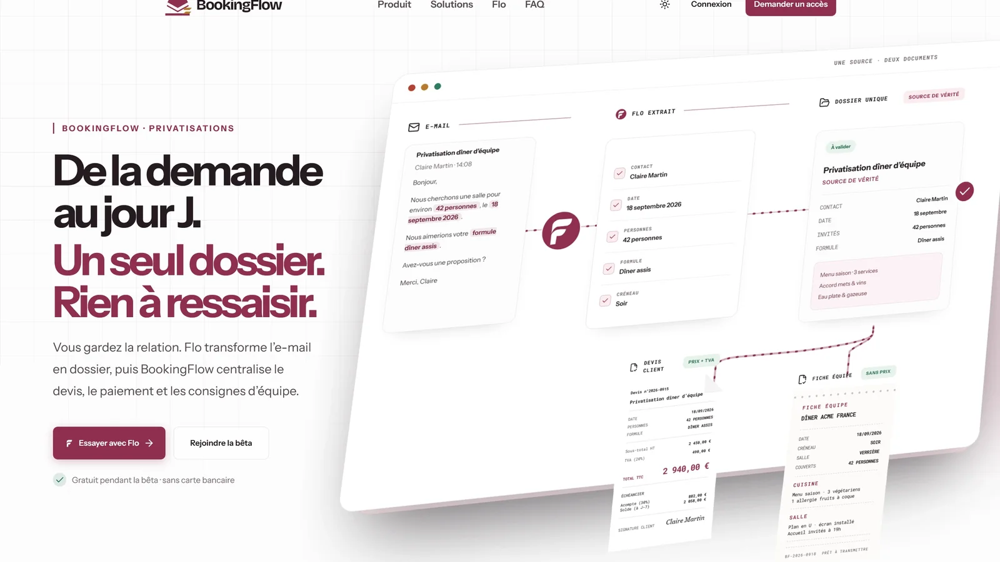
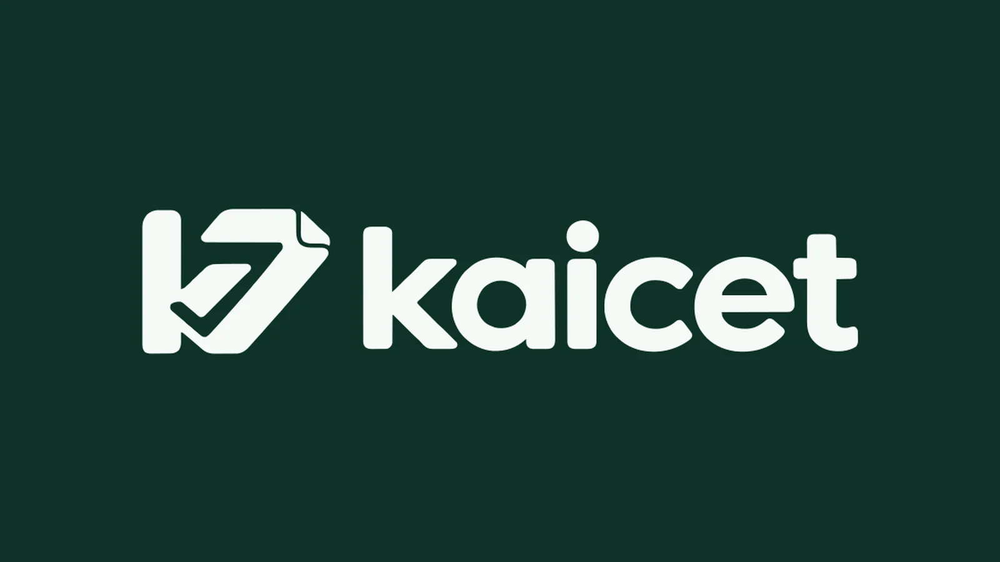
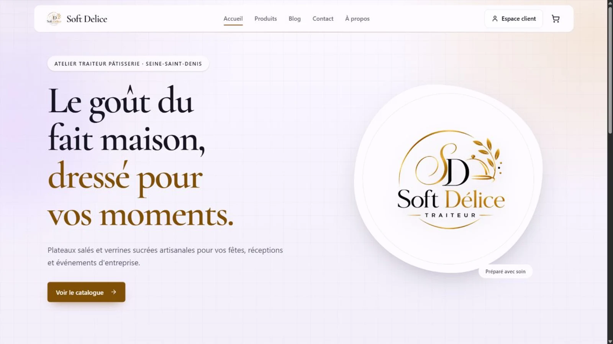
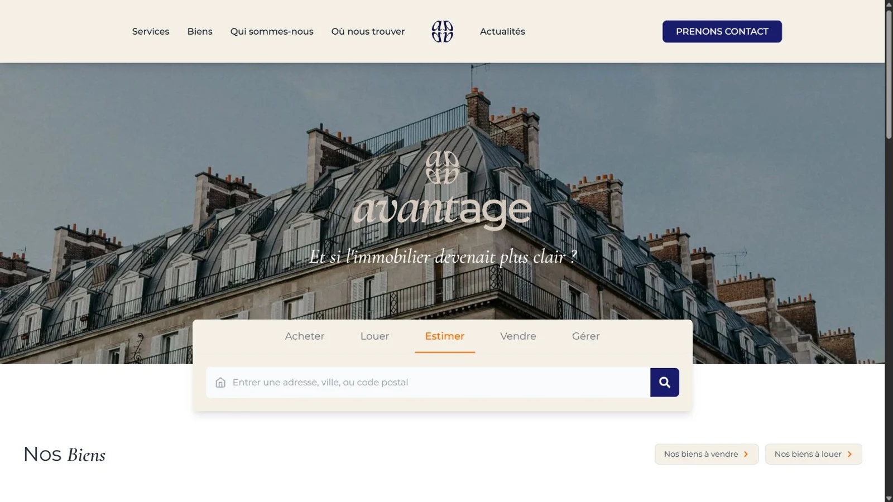

  

Je conçois des interfaces React et Next.js, puis je construis ce qui les fait fonctionner : données, authentification, paiements, emails, tests et mise en production. Je garde une vision complète du produit, du besoin initial à la maintenance.

**[Portfolio](https://www.samy-dev.fr)** · **[Projets](https://www.samy-dev.fr/projets)** · **[Profil recruteur](https://www.samy-dev.fr/recruteurs)** · **[Contact](https://www.samy-dev.fr/contact)**

## Ce que je fais

- **Conception produit** — comprendre le besoin, dessiner les parcours et organiser l’application.
- **Développement full-stack** — du composant React au modèle de données, avec TypeScript de bout en bout.
- **Mise en production** — tests, déploiement, SEO, emails, paiements et maintenance.
- **Développement agentique** — cadrer des missions, orchestrer plusieurs agents et vérifier leur travail avec un humain dans la boucle.

## Projets sélectionnés

<table>
  <tr>
    <td width="50%">
      
       <strong><a href="https://www.samy-dev.fr/projets/bookingflow">BookingFlow</a></strong> 
      Centralise les demandes de privatisation, devis, paiements et consignes d’équipe. Bêta privée utilisée par 3 établissements pilotes.
    </td>
    <td width="50%">
      
       <strong><a href="https://www.samy-dev.fr/projets/kaicet">Kaicet</a></strong> 
      Guide la clôture de caisse de plusieurs restaurants jusqu’au bilan signé. Parcours métier fonctionnel, produit en développement.
    </td>
  </tr>
  <tr>
    <td width="50%">
      
       <strong><a href="https://www.samy-dev.fr/projets/soft-delice">Soft-Délice</a></strong> 
      Relie une vitrine de traiteur au catalogue, au panier et au suivi des commandes. Le produit est en ligne.
    </td>
    <td width="50%">
      
       <strong><a href="https://www.samy-dev.fr/projets/avantage-immobilier">Avantage Immobilier</a></strong> 
      Synchronise les annonces d’une agence et transforme la recherche en prise de contact. Développé en collaboration avec Scandere.
    </td>
  </tr>
</table>

BookingFlow est né d’un besoin réel autour des réservations de groupe. J’ai initié le produit et construit sa première version full-stack avant de poursuivre son développement avec Abdel Samad, au contact des établissements pilotes.

## Stack actuelle

**Interfaces et application** 
Next.js · React · TypeScript · Tailwind CSS · TanStack Query · tRPC

**Données et services** 
PostgreSQL sur Neon · Prisma · Better Auth · Stripe · Resend · Vercel

J’ai aussi travaillé avec MongoDB sur des projets antérieurs. Mes produits récents s’appuient principalement sur PostgreSQL et Neon.

## Développement agentique

J’intègre l’IA à mon travail de développeur depuis 2025. Aujourd’hui, mon environnement s’appuie surtout sur Codex et Hermes, avec des règles, des skills et des procédures réutilisables. Je choisis les outils selon la qualité obtenue, le coût, les quotas et le temps de vérification ; la méthode reste portable si un autre modèle devient plus adapté.

Les agents explorent, préparent et vérifient dans un périmètre défini. Je garde la responsabilité de l’architecture, des décisions et de l’intégration finale.

## Parcours

- Holberton School, Paris La Défense : fondamentaux puis spécialisation full-stack.
- Titre RNCP niveau 6 en préparation.
- Développeur full-stack freelance et ouvert aux opportunités en équipe.
- Basé en Île-de-France, avec une préférence pour le télétravail.

## Me contacter

Tu peux consulter mes études de cas sur **[samy-dev.fr](https://www.samy-dev.fr)** ou m’écrire à **[contact@samy-dev.fr](mailto:contact@samy-dev.fr)**.

**[LinkedIn](https://www.linkedin.com/in/samy-ajouid-5779772b7/)** · **[GitHub](https://github.com/MrSamy91)**
